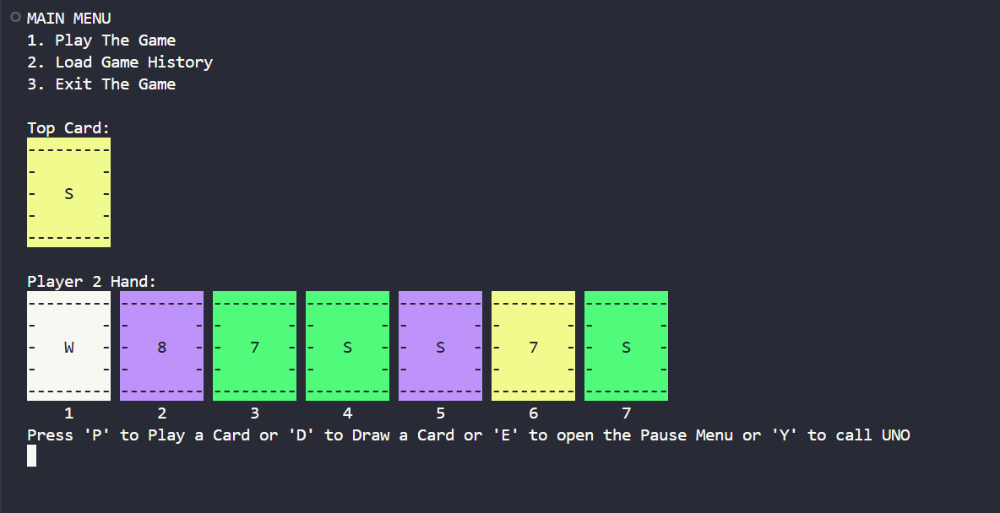

# 🃏 UNO Game (C++)

A terminal-based implementation of the classic **UNO card game** written in **C++**.  


<p align="center">
  
</p>

---

## 🎮 Features

- Full playable UNO game in the terminal
- Multiple players support
- Card matching by **color or number**
- Special cards:
  - Skip
  - Reverse
  - Draw Two
  - Wild Card
  - Wild Draw Four
- Dynamic card deck handling
- Game history loading
- Interactive menu system

---


## 📂 Project Structure

```
UNO/
│
├── main.cpp        # Main game source code
├── preveiw.png
├── README.md
```

---

## ⚙️ Compilation

Compile the project using **g++**:

```bash
g++ main.cpp -o uno
```

---

## ▶️ Running the Game

```bash
./uno
```

---

## 🕹️ Game Menu

When you start the program you will see:

```
MAIN MENU
1. Play The Game
2. Load Game History
3. Exit The Game
```

---

## 🧪 Example Gameplay

Players take turns placing cards that match the **color or number** of the top card in the discard pile.

Example:

```
Top Card: Red 5

Player Hand:
1. Blue 5
2. Red 9
3. Green Skip
```

Player can play:
- **Blue 5** (same number)
- **Red 9** (same color)

---

## 📸 Preview

<p align="center">
  
</p>

---

## 📌 Requirements

- C++ Compiler (GCC / MinGW / Clang)
- Terminal / Command Prompt

---

## 🚀 Future Improvements

- AI players
- Better UI for card display
- Multiplayer over network
- GUI version using Qt / SFML

---

## 👨‍💻 Author

Developed as a **complete shenanigan**.

---

⭐ If you like the project, consider giving it a **star on GitHub!**
